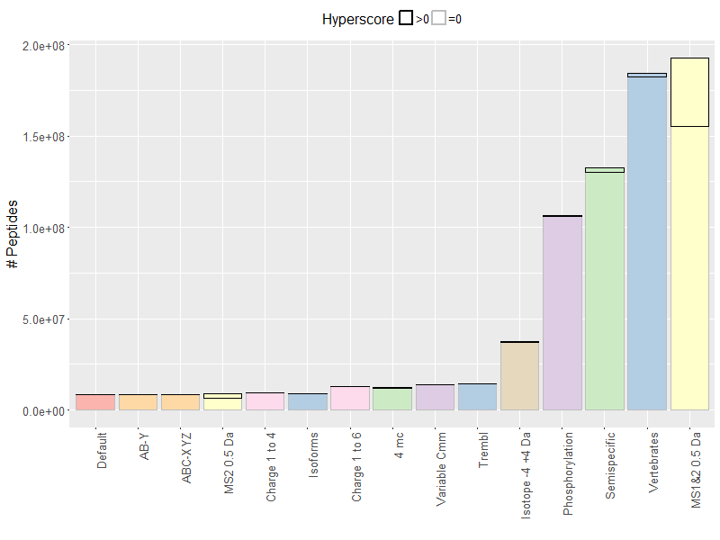
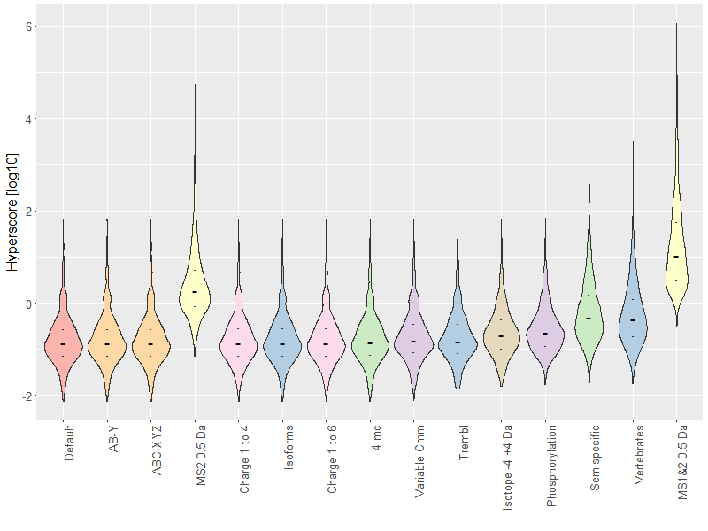
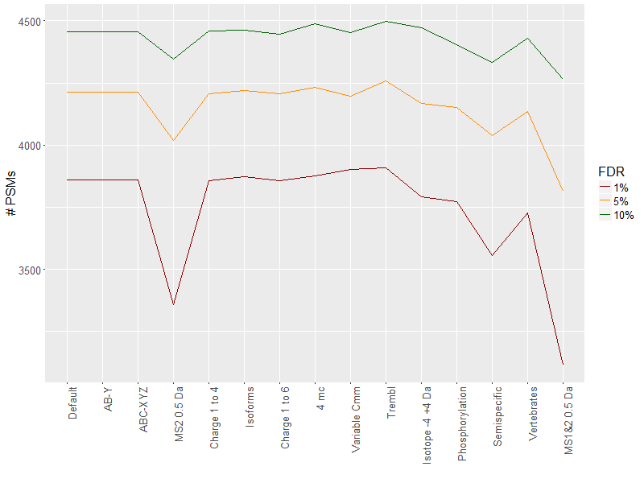

# Figure Review

figure 4 of our review on database search engines. We aimed at representing the different parameters that influence the search space. The PeptideShaker example, a 1 hour gradient HeLa measurement on a Q Exactive, was searched with different search settings deviating from the Default search settings by one parameter.

## The original

The original version of the figure was an attempt at schematically representing the effect of the different parameters on the search space. It was received with limited enthusiasm by the reviewer.

## Search settings

|     | Category        | Name            | Description                                                                                             |
| --- |:---------------:|:---------------:| ------------------------------------------------------------------------------------------------------- |
| 0   | Default         | Default         | The default search parameters                                                                           |
| 1   | Database        | Isoforms        | Search with isoforms included                                                                           |
| 2   | Database        | Trembl          | Search with Trembl sequences included                                                                   |
| 3   | Database        | Vertebrates     | Search of all Vertebrate sequences                                                                      |
| 4   | Digestion       | 4 mc            | Search with 4 missed cleavages allowd                                                                   |
| 5   | Digestion       | Semispecific    | Search using semispecific digestion                                                                     |
| 6   | Modifications   | Variable Cmm    | Search with cysteine carbamidomethylation as variable                                                    |
| 7   | Modifications   | Phosphorylation | Search with phosphorylation of S, T, Y as variable modificaiton (up to 5 modification sites tested)     |
| 8   | Fragmentation   | A,B,Y           | Search including a ions                                                                                 |
| 9   | Fragmentation   | A,B,C,X,Y,Z     | Search including all fragment ions                                                                      |
| 10  | Tolerances      | MS2 0.5 Da      | Search with 0.5 Da as MS2 tolerance                                                                     |
| 11  | Tolerances      | MS1&2 0.5 Da    | Search with 0.5 Da as MS1 and MS2 tolerance                                                             |
| 12  | Isotopes        | -4 to +4 Da     | Search including isotope correction from -4 to +4 Da                                                    |
| 13  | Charges         | 1 to 4          | Search including charge 1 to 4                                                                          |
| 14  | Charges         | 1 to 6          | Search including charge 1 to 6                                                                          |

Table 1: 14 different ways of enlarging the search space were benchmarked. Search settings are groupped into seven categories: (1) _Database_ for changes in the database, (2) _Digestion_ for changes in the protein digestion settings, (3) _Modifications_ for changes in the variable modifications taken into account, (4) _Fragmentation_ for changes in the fragment ions considered, (5) _Tolerances_ for changes in the m/z tolerances, (6) _Isotopes_ for changes in the isotope correction, and (7) _Charges_ for changes in the precursor charges considered.

## Search space

Figure 4A: The density of the number of possible peptides per precursor is plotted as violin plot for every parameter of Table 1 after logarithm base 10 transformation. In each case, a large dash represents the median and two smaller dashes represent the upper and lower quartiles. The densities are colored according to the categories of Table 1 and ordered by increasing median.

This figure is obtained using the following script

> R/SearchSpaceIllustration.R

## Zeros

Figure 4B: The number of peptides considered during the search is plotted for every setting of Table 1 in the same order and coloring as for Figure 4A. The peptides with a hyperscore > 0 are outlined in black.

This figure is obtained using the following script.

> R/nZerosIllustration.R

*Note: SearchSpaceIllustration.R needs to be run previously and the objects kept in the workspace.*

## False positive score distribution

Figure 4C: The density of the scores of decoy hits are plotted as in Figure 4A using the same order.

This figure is obtained using the following script.

> R/nZerosIllustration.R

*Note: ScoreIllustration.R needs to be run previously and the objects kept in the workspace.*

## ID rate

Figure 4D: The number of target PSMs in every condition is plotted at 1%, 5%, and 10% FDR in green, orange, and red, respectively.

This figure is obtained using the following script.

> R/idRateIllustration.R

*Note: ScoreIllustration.R needs to be run previously and the objects kept in the workspace.*

